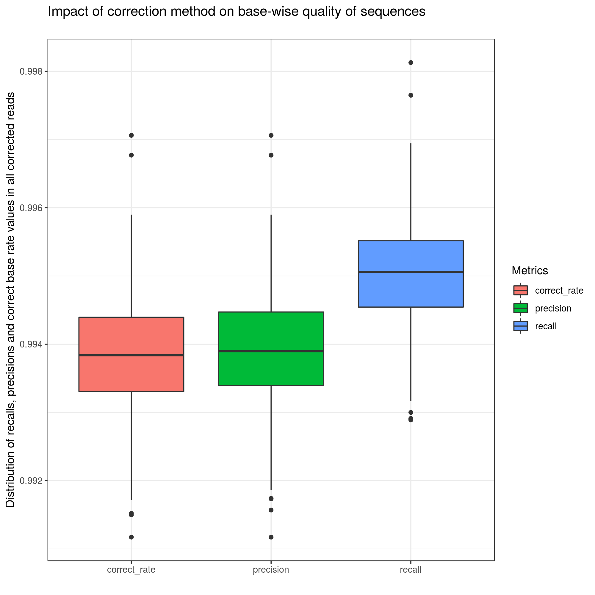

EvaLuation of Error Correction Tools for lOng Reads
=================================================

# Description
* This program enables the testing of different hybrid and non hybrid long read correction tools.
* It embeds a modified version of [poaV2](https://sourceforge.net/projects/poamsa/)
* Authors: Camille Marchet @kamimrcht, Pierre Morisse @morispi, Lolita Lecompte @llecompt, Antoine Limasset @malfoy. Many thanks to Pierre Marijon @natir.


# Requirements
* gcc and C++11
* Python3 and Biopython
* R
* multirow LaTeX module

# Usage

## Installation

	git clone --recursive https://github.com/kamimrcht/ELECTOR

	./install.sh
	python3 setup.py install

Binaries are then in ./bin. ELECTOR can be run using `elector.py` in the main directory.

## Running ELECTOR

### Input files
ELECTOR can be run on simulated and real data. For simulated reads, NanoSim and SimLord are the two supported simulators.
However, other long reads simulation tools can also be used.
In this case, the user must provide the reference sequences to ELECTOR itself.
Further configuration of the simulation tools such as the error rate, or the long reads coverage, is the user's call and has no impact on the ELECTOR pipeline.
The genome used for the simulation, the files generated by the simulator, and the corrected reads, output by the desired correction method, are then provided as an input to our pipeline.
For hybrid correction methods, whether the short reads are real or simulated has no impact on ELECTOR.

ELECTOR can be run with:

	python3 -m elector -reference referenceGenome.fa -uncorrected simulatedReadsPrefix -corrected correctedReads.fa -threads nbThreads -corrector correctorName -simulator simulatorName -output out

where

* referenceGenome.fa is the reference genome, with one sequence per line.

* simulatedReadsPrefix is the prefix of the uncorrected reads that were simulated.

* correctedReads.fa is the corrected version of the simulated reads, with one sequence per line. The corrected reads can be trimmed and/or split, or not.

* nbThreads is the number of threads to use.

* correctorName is the corrector that was used to correct the reads. Please see the list of compatible correctors below.

* simulatorName is the simulator that was used to simulate the long reads. Please see the list of compatible simulators below.

* out is a directory where to write the output


The reference reads can also be directly provided, with:

	python3 -m elector -perfect referenceReads.fa -uncorrected uncorrectedReads.fa -corrected correctedReads.fa -threads nbThreads -corrector correctorName

If the corrected long reads are **split**, the -split option MUST be provided to ELECTOR.

## Help

	python3 -m elector.py

## Current compatible correctors

* Proovread

* LoRDEC

* Nanocorr

* NaS

* CoLoRMap

* HG-CoLoR

* HALC

* PBDAGCon

* Canu

* LoRMA

* daccord

* MECAT

If one of those tools is provided with the -corrector parameter, the pipeline will itself retrieve the correspondance between corrected, uncorrected and reference reads.
If another tool is used, please do not use the -corrector parameter, and make sure that the headers of the corrected reads are similar to those of the reference and uncorrected reads.

## Compatible simulators

* SimLord

* NanoSim

If one of those tools is provided with the -simulator parameter, the pipeline will itself generate the reference reads.


## Output Example
Using files from example generated from ~10X _E coli_ long reads:

	python3 -m elector -uncorrected  example/uncorrected_reads_elector.fa -perfect example/perfect_reads_elector.fa -corrected  example/corrected_reads_elector.fa -output out -split -corrector lordec -simulator simlord

Output will be written in ``out`` directory. Here's an example of the log written in stdout (same information can be found in ``out/log``):
```
*********** SUMMARY ***********
Assessed reads:  459
Throughput (uncorrected) 4367089
Throughput (corrected):  4454164
Recall: 0.995006
Precision: 0.9938972
Average correct bases rate (uncorrected):  0.8970857918784844
Error rate (uncorrected): 0.10291420812151564
Average correct bases rate (corrected):  0.9938413
Error rate (corrected): 0.006158699999999961
Number of trimmed/split reads: 37
Mean missing size in trimmed/split reads: 2406.6
Number of over-corrected reads by extention:  4
Mean extension size in over-corrected reads:  40.0
%GC in reference reads:  51.1
%GC in corrected reads:  51.1
Number of corrected reads which length is < 10.0 % of the original read: 25
Number of very low quality corrected reads:  0
Number of insertions in uncorrected:  159839
Number of insertions in corrected:  8119
Number of deletions in uncorrected:  160207
Number of deletions in corrected:  8161
Number of substitutions in uncorrected:  154842
Number of substitutions in corrected:  12148
Ratio of homopolymer sizes in corrected vs reference: 0.9925
```
Details for each section in the [manuscript](https://www.biorxiv.org/content/10.1101/512889v2).

These results are recalled in out/log and out/summary.pdf along with figures:

<p align="center">

</p>
<!---->

Recall and precision computed for each read after correction.
Recall is the rate of correct bases out of bases that needed correction in the
original read, precision is the rate of correct bases out of the number of bases
that were modified by the correction method.

<p align="center">

</p>
<!---->

 Size distributions after correction. ”Sequences” relate to each
fasta sequence of the corrected file. ”Reads” relate to corrected reads. In case
of split reads, a ”read” can be composed of two ”sequences” for instance. This
is why we report two different distributions. In case no read is split, we only
report read length distribution.


# Manuscript

[ELECTOR: Evaluator for long reads correction methods. Camille Marchet, Pierre Morisse, Lolita Lecompte, Arnaud Lefebvre, Thierry Lecroq, Pierre Peterlongo, Antoine limasset](https://www.biorxiv.org/content/10.1101/512889v2)

## Reproducing manuscript results

All scripts used to produce the results in our manuscript are provided in the folder [reproduce_manuscript_results](https://github.com/kamimrcht/ELECTOR/tree/master/reproduce_manuscript_results).

